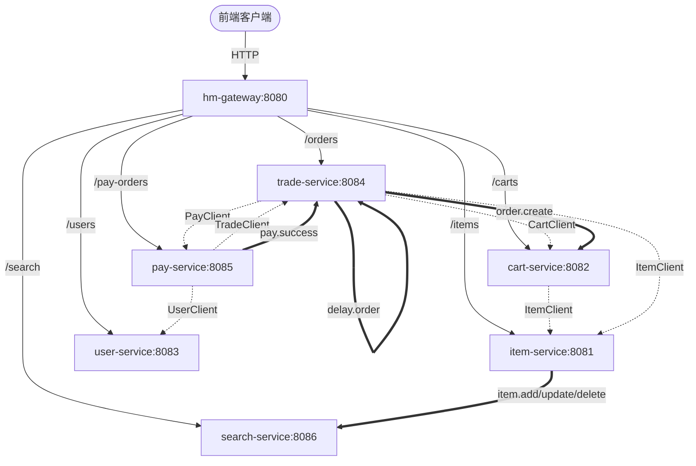

# EStore微服务系统

本项目是一个基于 **Spring Cloud Alibaba** 架构搭建的电商微服务商城系统。系统经过微服务架构拆分，解耦了商品、购物车、用户、订单、支付以及搜索等核心业务，并集成了服务发现、动态路由、分布式事务、流量防卫及消息队列等企业级中间件。

---

## 🛠️ 技术选型与架构支撑

*   **核心框架**：Spring Boot 2.7.12, Spring Cloud 2021.0.3, Spring Cloud Alibaba 2021.0.4.0
*   **注册 & 配置中心**：Nacos (服务注册、健康检查及多环境配置动态刷新)
*   **统一网关**：Spring Cloud Gateway (支持基于 Nacos 的动态路由加载及 JWT 非对称加密登录校验)
*   **持久层框架**：MyBatis-Plus 3.4.3 & MySQL 8.0
*   **搜索引擎**：Elasticsearch 7.12.1 (用于商品高亮搜索与聚合过滤)
*   **消息队列**：RabbitMQ (用于订单创建/购物车清理异步解耦、支付状态更新及延迟双通道订单超时自动关闭)
*   **流量控制**：Sentinel (微服务接口限流、熔断与降级保护)
*   **分布式事务**：Seata (保证跨服务调用的数据强一致性)

---

## 📂 项目模块与运行端口对照

| 模块名称 | 端口 | 核心职责 |
| :--- | :--- | :--- |
| **`hm-gateway`** | `8080` | API 网关入口、身份拦截（JWT 校验）、动态路由 |
| **`item-service`** | `8081` | 商品服务：商品列表、类目维护、库存扣减与恢复 |
| **`cart-service`** | `8082` | 购物车服务：购物车添加、列表查询、删除及异步清理 |
| **`user-service`** | `8083` | 用户服务：用户登录、地址管理、账户余额查询与扣款 |
| **`trade-service`** | `8084` | 订单服务：创建订单、更新订单状态、延迟队列超时关单 |
| **`pay-service`** | `8085` | 支付服务：发起支付、查询支付流水、扣减用户余额并回调 |
| **`search-service`** | `8086` | 搜索服务：基于 Elasticsearch 实现商品高亮查询与品牌/分类聚合 |
| **`hm-api`** | - | 公共 Feign 接口定义与熔断降级 Fallback 逻辑 |
| **`hm-common`** | - | 基础工具类、统一异常处理、基础 POJO 定义 |
| **`hm-service`** | `8080` | 原始单体服务（留作拆分对照） |

---

## 🔄 服务间调用拓扑图

项目服务之间的**同步 Feign 调用**与**异步 MQ 消息通知**关系如下所示：

---

## 🚀 快速启动指南

### 1. 环境准备
*   **Java**: JDK 11
*   **Maven**: 3.6+
*   **中间件**:
    *   MySQL 8.0 (导入对应服务数据库表结构)
    *   Nacos 2.x (作为注册中心与配置中心，需上传共享配置文件如 `shared-jdbc.yaml`、`shared-log.yaml` 等)
    *   RabbitMQ 3.8+ (需开启延迟消息队列插件 `rabbitmq_delayed_message_exchange`)
    *   Elasticsearch 7.12.1 (创建 `items` 索引并导入商品文档)

### 2. 导入配置
在 Nacos 配置中心中创建以下配置文件：
*   `shared-jdbc.yaml`：配置数据库连接信息。
*   `shared-log.yaml`：日志记录级别及输出规则。
*   `shared-swagger.yaml`： Knife4j/Swagger 接口文档配置。
*   `shared-seata.yaml`： Seata 事务管理器配置。
*   `hmall-gateway-router.json`：配置网关的动态路由映射表（对应 `hm-gateway` 中的动态路由加载逻辑）。

### 3. 服务启动顺序建议
1.  启动 **Nacos**、**MySQL**、**RabbitMQ**、**Elasticsearch**；
2.  启动 **`hm-gateway`** 网关服务；
3.  启动 **`user-service`**、**`item-service`** 基础业务服务；
4.  启动 **`cart-service`**、**`trade-service`**、**`pay-service`**；
5.  启动 **`search-service`** 搜索同步服务。

---

## 📄 许可证

本项目遵循 [MIT License](LICENSE) 许可协议。
